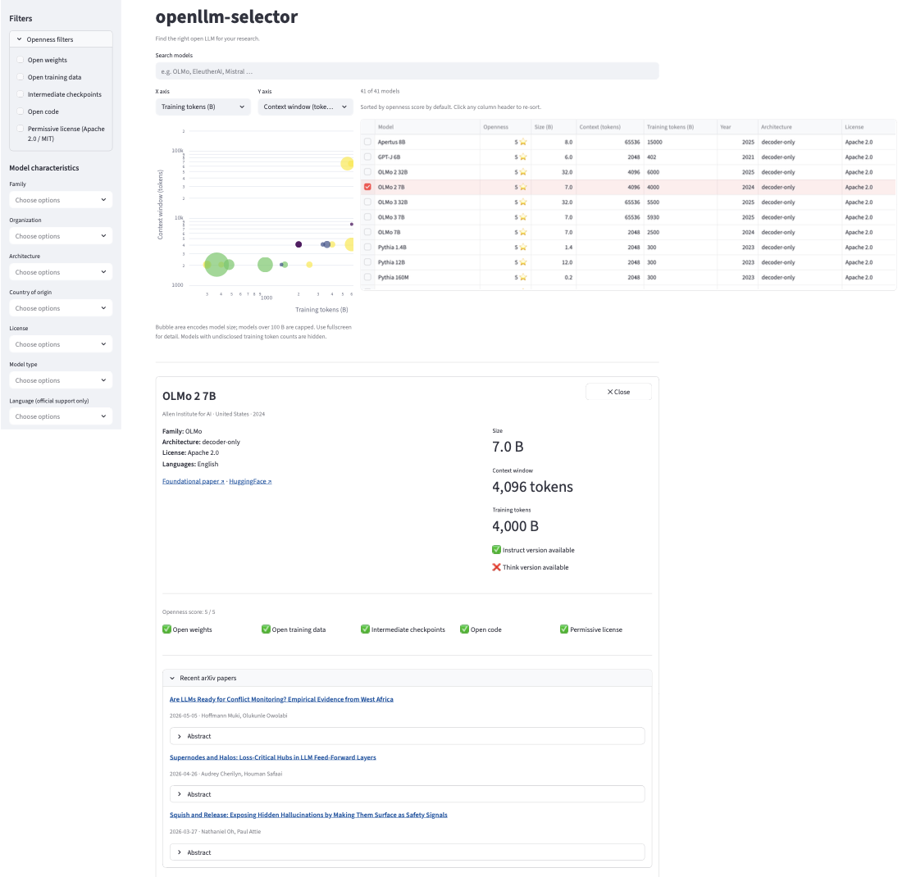

# openllm-selector

A tool to help researchers pick the right open LLM for their study.

Choosing the right open LLM for research is hard given the rapidly growing landscape of available models. Most comparison tools ask "which model scores highest on MMLU?" — that is not a useful question for research. What matters is: can I reproduce this model's training? Is the license compatible with my institution's data sharing agreement? Does it support the languages in my corpus? Will it fit on the GPUs I have access to?

`openllm-selector` is a curated database of 41 open LLMs with an interactive Streamlit app and a queryable Python API. Every record tracks the characteristics that actually drive research decisions rather than benchmark scores.

Each model record contains 25 fields covering identity, size, training scale, context window, modality, architecture, license, openness flags, language support, and links to the foundational paper and HuggingFace page. Most records are base models; a small number are instruct or reasoning variants.

## Installation

```bash
pip install git+https://github.com/Programming-The-Next-Step-2026/openllm-selector.git@week-4
```

To run the interactive Streamlit app locally:

```bash
git clone https://github.com/Programming-The-Next-Step-2026/openllm-selector.git
cd openllm-selector
git checkout week-4
streamlit run app/app.py
```

## Streamlit app

The interactive app has a filter sidebar, an interactive scatter plot where bubble size encodes model size and colour encodes openness score, a sortable results grid, and a profile card with links to the foundational paper and recent arXiv papers.



## Python API

```python
import openllm_selector as o

# Filter by any combination of fields
candidates = o.filter_models(intermediate_checkpoints=True, max_size_b=10)
ranked = o.rank_by_openness(candidates)

# Look up a single model
model = o.get_model("OLMo 2 7B")

# Filter by officially supported language
hindi_models = o.filter_models(language="Hindi")

# Browse all supported languages
languages = o.get_languages()

# Filter by model type or think version availability
reasoning_models = o.filter_models(model_type="reasoning")
think_models = o.filter_models(has_think_version=True)

# Fetch recent arXiv papers mentioning a model
papers = o.fetch_recent_papers("OLMo", max_results=3)
```

## Documentation

See [docs/vignette.qmd](docs/vignette.qmd) for a full walkthrough covering both the Streamlit app and the Python API, with five realistic researcher scenarios. [View the rendered tutorial](https://htmlpreview.github.io/?https://github.com/Programming-The-Next-Step-2026/openllm-selector/blob/week-4/docs/vignette.html)
