Most LLM comparison tools ask "which model scores highest on MMLU?" That is not a useful question for research. What matters is: can I reproduce this model's training? Is the license compatible with my institution's data sharing agreement? Does it support the languages in my corpus? Will it fit on the GPUs I have access to?

`openllm-selector` is a curated database of 41 open LLMs with a queryable Python API and an interactive Streamlit app. Every record tracks the characteristics that actually drive research decisions — weights availability, training data transparency, intermediate checkpoints for training-dynamics studies, license, number of supported languages, training token count, and whether an instruct variant exists — rather than benchmark leaderboard positions. Languages reflect officially supported languages as documented by the model creators, not partial or limited capabilities (e.g. Falcon supports German, Spanish and French officially, but has only limited capabilities in several other languages which are not included).

An optional `notes` field is present for models that require additional context, such as post-trained models where `training_tokens_b` is null for structural reasons rather than lack of disclosure (e.g. DeepSeek-R1 is post-trained on DeepSeek-V3-Base, so a pre-training token count is not applicable).

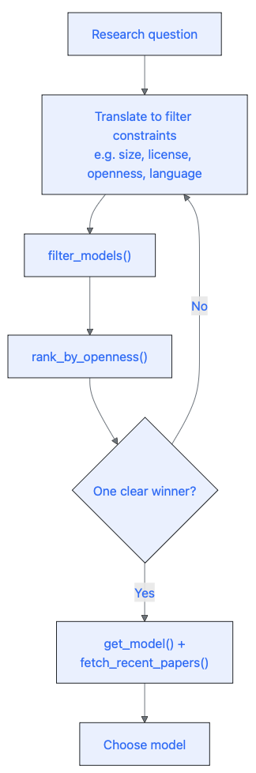

## Installation

```bash
pip install git+https://github.com/Programming-The-Next-Step-2026/openllm-selector.git@week-3
```

To run the interactive app locally:

```bash
streamlit run app/app.py
```

---

## Using the app

The app has three panels: a **filter sidebar** on the left, a **scatter plot** and **results grid** in the main area, and a **model profile card** that opens below when you click any row or bubble.

### Sidebar

The sidebar is organised into five sections:

1. **Openness filters** — checkboxes for open weights, open training data, intermediate checkpoints, open code, and permissive license (Apache 2.0 or MIT).

2. **Model characteristics** — categorical multiselects for family, organisation, architecture, country of origin, and license (OR logic: a model is kept if it matches any selected value). Below these: a **Model type** dropdown to restrict to `base`, `instruct`, or `reasoning` models, a **Language (official support only)** dropdown to filter by a single officially supported language, an **Instruct version available** checkbox, a **Think version available** checkbox, and a **Multilingual** checkbox.

3. **Exclusion filters** expander — multiselects to remove models by family, organisation, country of origin, or license.

4. **Ranges** — sliders for size (B parameters), context window (tokens), release year, and training tokens (B).

5. **Reset all filters** button at the bottom.

### Scatter plot

The default view plots training tokens (B) on the x-axis against context window on the y-axis. You can switch either axis to: context window, release year, training tokens, or number of languages. Bubble colour encodes openness score (1–5, Viridis scale) and bubble area encodes model size in billions of parameters, capped at 100 B. Clicking a bubble opens the profile card for that model.

### Results grid

The grid shows the filtered models ranked by openness score by default and displays: model name, openness score, size (B), context window, training tokens (B), release year, architecture, and license. Clicking any column header re-sorts the results by that column in ascending or descending order. Clicking a row opens the profile card.

### Profile card

The profile card shows family, architecture, license, supported languages, and links to the foundational paper and HuggingFace page on the left, and size, context window, training tokens, and instruct version availability on the right. Below the main details: the five openness badges (open weights, open training data, intermediate checkpoints, open code, permissive license) with an overall openness score, followed by a **Recent arXiv papers** section that fetches the three most recent papers mentioning the model from arXiv.

---

The five scenarios below walk through how a researcher would use the app.

---

### Scenario a — Training dynamics researcher

*You are studying how in-context learning ability develops over the course of training. You need a model that released intermediate checkpoints, is small enough to run on a single GPU, and is as openly licensed as possible.*

In the sidebar:

1. Under **Openness filters** → check **Intermediate checkpoints**
2. Under **Ranges**, drag the **Size (B parameters)** slider to a maximum of 11 B

The grid immediately narrows to twelve models, all with an openness score of 5: Apertus 8B, GPT-J 6B, OLMo 2 7B, OLMo 3 7B, OLMo 7B, and seven Pythia models (Pythia 1.4B, Pythia 160M, Pythia 1B, Pythia 2.8B, Pythia 410M, Pythia 6.9B, and Pythia 70M). Click OLMo 2 7B to open its profile card, which shows the foundational paper link and fetches the three most recent arXiv papers mentioning the model. If your GPU budget extends to 32 B, also remove the size cap — OLMo 2 32B and OLMo 3 32B pass every other criterion, and OLMo 3 32B also has a think variant available.

::: {layout='[[1,4]]'}

::: {}
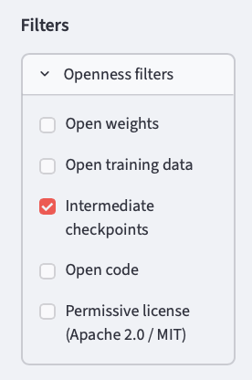

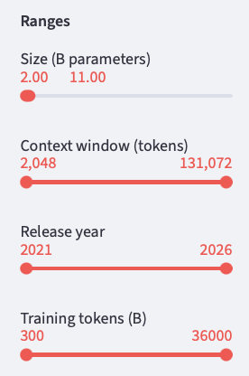
:::

::: {}
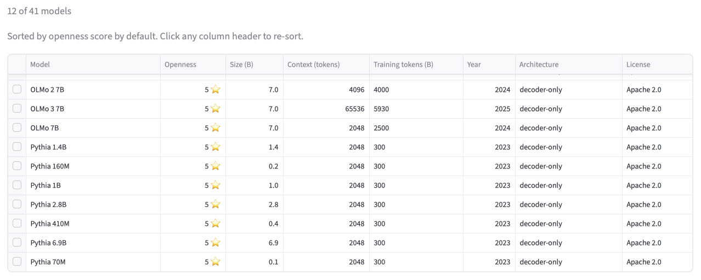

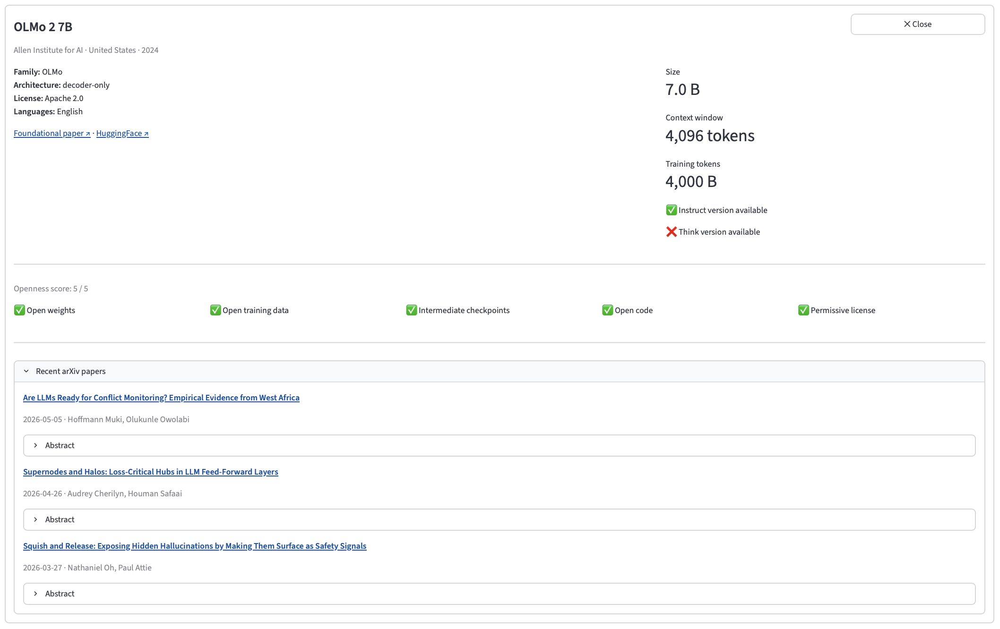
:::

:::

---

### Scenario b — European privacy-conscious researcher

*Your institution requires that training data not originate from US or Chinese organisations, to avoid jurisdictional complications with GDPR and data residency rules.*

In the sidebar:

1. Open **Exclusion filters** → **Exclude country of origin** → select or type **United States** and **China**

Eight models remain: Apertus 8B (Switzerland, score 5), BLOOM 176B and the three Mistral models (France), the two Falcon models (United Arab Emirates), and Sarvam 30B (India, score 2). The scatter plot makes the trade-offs immediately visible: Apertus 8B leads on openness; BLOOM covers 46 languages but carries a BigScience RAIL license with restrictions on certain uses; the two Falcon models cover 4 languages each but are Apache 2.0 licensed.

::: {layout='[[1,4]]'}

::: {}
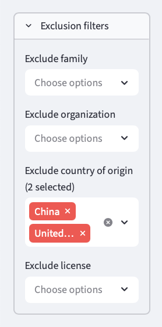
:::

::: {}
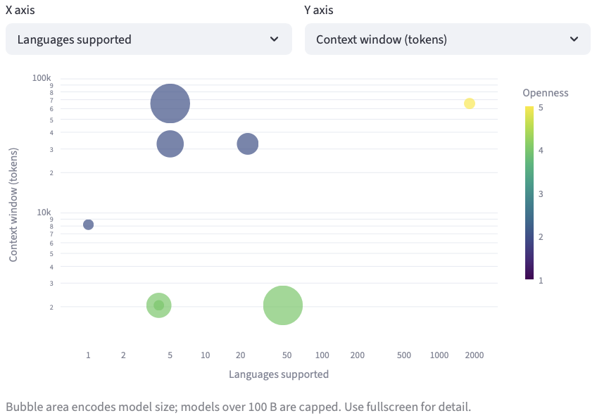
:::

:::

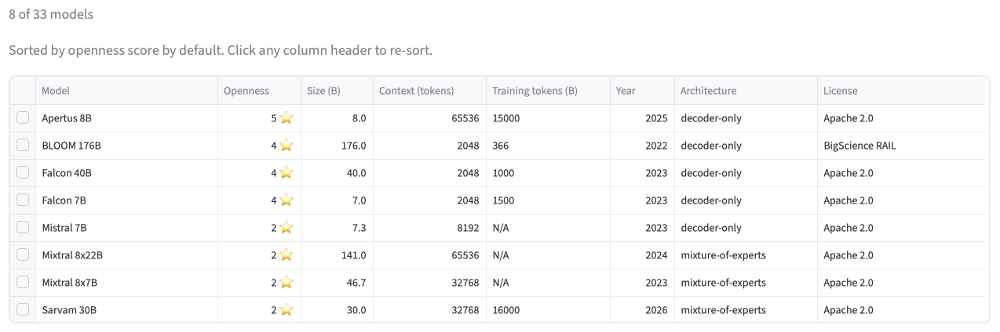

---

### Scenario c — Multilingual NLP researcher

*You are building a cross-lingual transfer benchmark and need a base model trained on multiple languages, with a license that allows redistributing fine-tuned derivatives.*

These are two independent filter approaches depending on how much you know about your language requirements upfront.

**Step 1 — Filter by openness and multilingual coverage.** Start here if you want models with documented multilingual training and publicly available weights and data.

In the sidebar:

1. Under **Openness filters** → check **Open weights** and **Open training data**
2. Check the **Multilingual** checkbox

Four models match: Apertus 8B (1,811 languages, Apache 2.0, score 5), BLOOM 176B (46 languages, BigScience RAIL license, score 4), Falcon 7B, and Falcon 40B (4 languages each, Apache 2.0, score 4). The license column in the grid makes the trade-off immediately visible.

::: {layout='[[1,4]]'}

::: {}
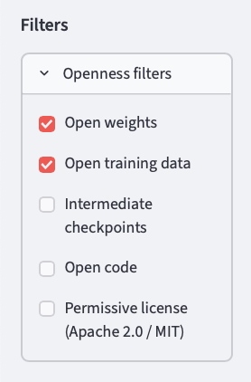

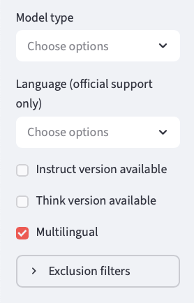
:::

::: {}
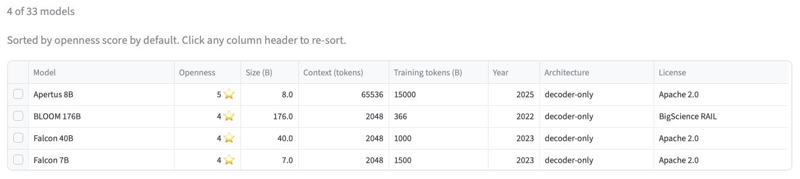
:::

:::

**Step 2 — Filter by a specific language.** Use this independently — without the openness filters active — when you need to know which models officially support a particular language, regardless of their openness profile.

In the sidebar (with all other filters reset):

1. Under **Language (official support only)** → select or type the language you need

Selecting **Hindi** returns six models: Apertus 8B, BLOOM 176B, Gemma 3 27B, Llama 3.1 8B, Qwen3 8B, and Sarvam 30B. Selecting **Japanese** returns four: Apertus 8B, Gemma 3 27B, Qwen2.5 7B, and Qwen3 8B.

::: {layout='[[1,4]]'}

::: {}
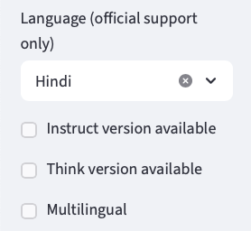

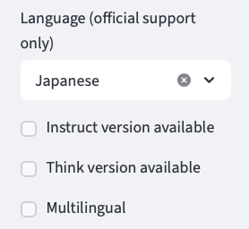
:::

::: {}
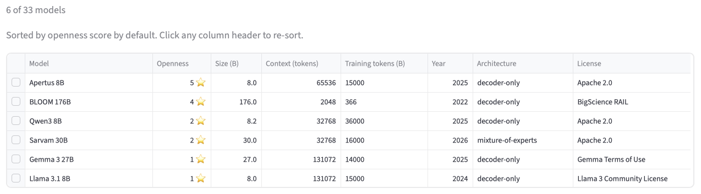

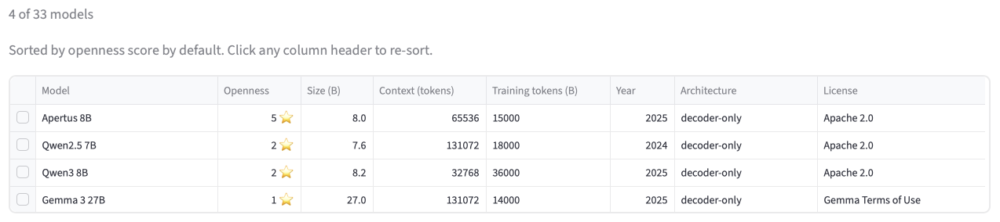
:::

:::

---

### Scenario d — Compute-limited researcher

*You have access to a single A100 (80 GB) but need a long context window for document-level tasks. You want the largest model that still fits comfortably, with at least 8 K tokens of context.*

In the sidebar:

1. Drag the **Size (B parameters)** slider to a maximum of 8.50 B
2. Move the **Context window (tokens)** slider minimum to **8,192**

Seven models appear. On the scatter plot with context window on the y-axis, three models stand out at 131 K context — Qwen2 7B, Qwen2.5 7B, and Llama 3.1 8B — an order of magnitude larger than Mistral 7B, Gemma 2B, Qwen3 8B, and the newly added Apertus 8B (65,536 tokens). Click each model to compare licenses and training details in the profile card before deciding.

::: {layout='[[1,4]]'}

::: {}
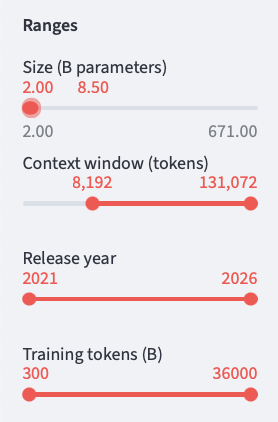
:::

::: {}
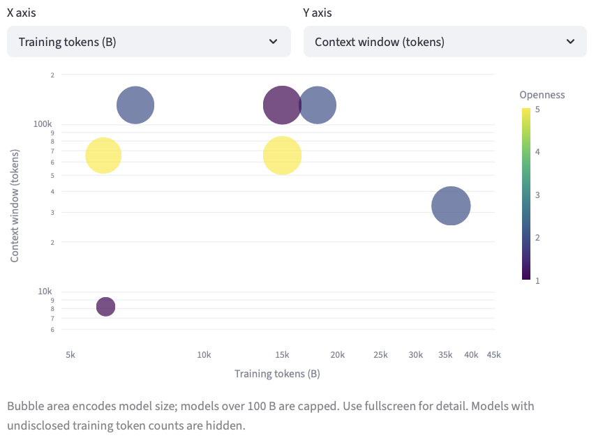
:::

:::

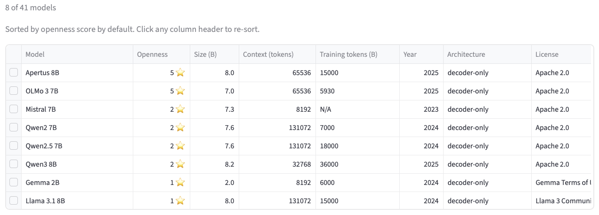

---

### Scenario e — Fully open science researcher

*You are writing a methods paper and want every step of your pipeline to be replicable: the model weights, the training data, the intermediate checkpoints, and the code all need to be publicly available under a permissive license.*

In the sidebar:

1. Under **Openness filters** → check **Open weights**, **Open training data**, **Intermediate checkpoints**, **Open code**, and **Permissive license**

Fifteen models score 5: Apertus 8B, GPT-J 6B, OLMo 2 7B, OLMo 2 32B, OLMo 3 7B, OLMo 3 32B, OLMo 7B, and all eight Pythia models. To narrow to fully open models with a think variant, also check the **Think version available** checkbox — two models remain: OLMo 3 7B and OLMo 3 32B. Click **OLMo 3 7B** to open its profile card — it and OLMo 3 32B are the only fully open models in the database with a chain-of-thought (think) variant. OLMo 3 7B is the recommended starting point for most research workflows — it scores 5/5 on openness and has a think variant, while being more accessible than the 32B variant due to its lower compute requirements. Check the recent arXiv papers fetched in the profile card to confirm that OLMo 3 7B is being actively used in the literature and that there are relevant papers building on it.

> *[Screenshot: all five openness checkboxes checked; fifteen results in the grid; OLMo 3 7B profile card open showing Recent arXiv papers expander]*

---

## Using the Python API

The same five questions answered in code. All functions are importable directly from `openllm_selector`.

```python
import openllm_selector as o
```

---

### Scenario a — Training dynamics researcher

```python
candidates = o.filter_models(intermediate_checkpoints=True, max_size_b=10)
ranked = o.rank_by_openness(candidates)

for m in ranked:
    print(m["name"], f"({m['size_b']} B,  score {m['openness_score']},  {m['training_tokens_b']:.0f} B tokens)")
#> Apertus 8B (8.0 B,  score 5,  15000 B tokens)
#> GPT-J 6B (6.0 B,  score 5,  402 B tokens)
#> OLMo 2 7B (7.0 B,  score 5,  4000 B tokens)
#> OLMo 3 7B (7.0 B,  score 5,  5930 B tokens)
#> OLMo 7B (7.0 B,  score 5,  2500 B tokens)
#> Pythia 1.4B (1.4 B,  score 5,  300 B tokens)
#> Pythia 160M (0.16 B,  score 5,  300 B tokens)
#> Pythia 1B (1.0 B,  score 5,  300 B tokens)
#> Pythia 2.8B (2.8 B,  score 5,  300 B tokens)
#> Pythia 410M (0.41 B,  score 5,  300 B tokens)
#> Pythia 6.9B (6.9 B,  score 5,  300 B tokens)
#> Pythia 70M (0.07 B,  score 5,  300 B tokens)
```

All twelve score 5 — the maximum — so openness alone does not break the tie. The deciding factor here is training scale: Apertus 8B leads with 15,000 B tokens; OLMo 2 7B was trained on 13× more tokens than any Pythia model and has a 4 K context window versus Pythia's 2 K. The Pythia suite is the go-to if your study needs a fixed community benchmark with established checkpoints at precise token intervals across multiple model sizes. Remove the size cap to also consider OLMo 2 32B and OLMo 3 32B — both score 5, and OLMo 3 32B is the only fully open model with a think variant.

```python
# Look up the foundational paper and confirm checkpoint availability
model = o.get_model("OLMo 2 7B")
print(model["foundational_paper"])
#> https://arxiv.org/abs/2501.00656
print(model["intermediate_checkpoints"])
#> True
```

---

### Scenario b — European privacy-conscious researcher

To exclude multiple countries, filter the result list directly — `filter_models()` takes one `exclude_country_of_origin` value at a time:

```python
excluded_countries = {"United States", "China"}
results = [m for m in o.filter_models() if m["country_of_origin"] not in excluded_countries]
ranked = o.rank_by_openness(results)

for m in ranked:
    print(m["name"], f"— {m['country_of_origin']}  (score {m['openness_score']})")
#> Apertus 8B — Switzerland  (score 5)
#> BLOOM 176B — France  (score 4)
#> Falcon 40B — United Arab Emirates  (score 4)
#> Falcon 7B — United Arab Emirates  (score 4)
#> Mistral 7B — France  (score 2)
#> Mixtral 8x22B — France  (score 2)
#> Mixtral 8x7B — France  (score 2)
#> Sarvam 30B — India  (score 2)
```

Eight models remain. Apertus 8B (Switzerland) scores 5 — the only fully open model outside the US and China. BLOOM and the two Falcons score 4. The three Mistral models and Sarvam 30B score 2 — their training data composition is not publicly disclosed. For most European research use cases, Falcon 7B or Apertus 8B is the pragmatic choice: both are Apache-licensed and trained on documented multilingual corpora.

---

### Scenario c — Multilingual NLP researcher

```python
results = o.filter_models(multilingual=True, min_openness=3)
ranked = o.rank_by_openness(results)

for m in ranked:
    print(
        m["name"],
        f"  {m['num_languages']} languages"
        f"  license: {m['license']}"
        f"  score: {m['openness_score']}"
    )
#> Apertus 8B  1811 languages  license: Apache 2.0  score: 5
#> BLOOM 176B  46 languages  license: BigScience RAIL  score: 4
#> Falcon 40B  4 languages  license: Apache 2.0  score: 4
#> Falcon 7B  4 languages  license: Apache 2.0  score: 4
```

Apertus 8B leads with 1,811 languages and a score of 5 — the broadest language coverage of any Apache-licensed model in the database. BLOOM covers 46 languages but its BigScience RAIL license restricts certain commercial and potentially harmful uses. If your benchmark is purely academic and you need broad language coverage, BLOOM is a strong option. If you need to redistribute fine-tuned derivatives without restriction, Apertus 8B or Falcon 7B with Apache 2.0 is the safer choice.

Use `filter_models(language=...)` to check whether a specific language you need is officially supported:

```python
hindi_models = o.filter_models(language="Hindi")
for m in hindi_models:
    print(m["name"], "—", m["languages"])
#> Apertus 8B — ['Albanian', 'Arabic', ..., 'Hindi', ..., 'Yoruba']
#> BLOOM 176B — ['Akkadian', 'Arabic', ..., 'Hindi', ..., 'Yoruba']
#> Gemma 3 27B — ['Afrikaans', 'Arabic', ..., 'Hindi', ..., 'Vietnamese']
#> Llama 3.1 8B — ['English', 'German', 'French', 'Italian', 'Portuguese', 'Hindi', 'Spanish', 'Thai']
#> Qwen3 8B — ['Afrikaans', 'Albanian', ..., 'Hindi', ..., 'Waray']
#> Sarvam 30B — ['Assamese', 'Bengali', ..., 'Hindi', ..., 'Urdu']
```

```python
# Inspect the full language list for BLOOM
bloom = o.get_model("BLOOM 176B")
print(bloom["num_languages"])    # 46
print(bloom["huggingface_id"])   # bigscience/bloom
print(bloom["languages"][:5])   # first five of 46
#> ['Akkadian', 'Arabic', 'Assamese', 'Bambara', 'Basque']

# Browse all languages present in the database
all_langs = o.get_languages()
print(len(all_langs), "unique languages")
#> 111 unique languages

# Filter by a single language — Japanese is supported by Apertus 8B, Gemma 3 27B, Qwen2.5 7B, and Qwen3 8B
japanese_models = o.filter_models(language="Japanese")
for m in japanese_models:
    print(m["name"])
#> Apertus 8B
#> Gemma 3 27B
#> Qwen2.5 7B
#> Qwen3 8B
```

---

### Scenario d — Compute-limited researcher

```python
results = o.filter_models(max_size_b=8, min_context_window=8192)
ranked = o.rank_by_openness(results)

for m in ranked:
    print(
        m["name"],
        f"  {m['size_b']} B"
        f"  context: {m['context_window']:,} tokens"
        f"  license: {m['license']}"
    )
#> Apertus 8B   8.0 B  context: 65,536 tokens  license: Apache 2.0
#> Mistral 7B   7.3 B  context: 8,192 tokens  license: Apache 2.0
#> Qwen2 7B   7.6 B  context: 131,072 tokens  license: Apache 2.0
#> Qwen2.5 7B   7.6 B  context: 131,072 tokens  license: Apache 2.0
#> Gemma 2B   2.0 B  context: 8,192 tokens  license: Gemma Terms of Use
#> Llama 3.1 8B   8.0 B  context: 131,072 tokens  license: Llama 3 Community License
```

Six models pass the filter. Qwen2 7B, Qwen2.5 7B, and Llama 3.1 8B offer 131 K context windows — suitable for full-document processing. Apertus 8B adds 65,536 tokens of context with an Apache 2.0 license and score 5. Both Qwen models use Apache 2.0; Llama 3.1 carries Meta's community license, which restricts use beyond 700 M monthly users. For typical research use, any of the three long-context Apache options works. Qwen2.5 7B is the strongest on training scale and language coverage. If your documents are consistently under 10 K tokens, Mistral 7B is a leaner alternative.

```python
# Compare training scale and language coverage across the three long-context options
for name in ["Qwen2 7B", "Qwen2.5 7B", "Llama 3.1 8B"]:
    m = o.get_model(name)
    print(f"{name}: {m['training_tokens_b']:.0f} B tokens, {m['num_languages']} languages")
#> Qwen2 7B: 7000 B tokens, 27 languages
#> Qwen2.5 7B: 18000 B tokens, 29 languages
#> Llama 3.1 8B: 15000 B tokens, 8 languages
```

Qwen2.5 7B was trained on 2.6× more tokens than Qwen2 7B and supports 29 languages — the largest training budget among Apache 2.0 options in this size range.

---

### Scenario e — Fully open science researcher

```python
fully_open = o.filter_models(min_openness=5)
ranked = o.rank_by_openness(fully_open)

for m in ranked:
    print(
        m["name"],
        f"  {m['size_b']} B"
        f"  tokens={m['training_tokens_b']:.0f} B"
        f"  think={m['has_think_version']}"
    )
#> Apertus 8B   8.0 B  tokens=15000 B  think=False
#> GPT-J 6B   6.0 B  tokens=402 B  think=False
#> OLMo 2 32B   32.0 B  tokens=6000 B  think=False
#> OLMo 2 7B   7.0 B  tokens=4000 B  think=False
#> OLMo 3 32B   32.0 B  tokens=5500 B  think=True
#> OLMo 3 7B   7.0 B  tokens=5930 B  think=True
#> OLMo 7B   7.0 B  tokens=2500 B  think=False
#> Pythia 1.4B   1.4 B  tokens=300 B  think=False
#> Pythia 12B   12.0 B  tokens=300 B  think=False
#> Pythia 160M   0.16 B  tokens=300 B  think=False
#> Pythia 1B   1.0 B  tokens=300 B  think=False
#> Pythia 2.8B   2.8 B  tokens=300 B  think=False
#> Pythia 410M   0.41 B  tokens=300 B  think=False
#> Pythia 6.9B   6.9 B  tokens=300 B  think=False
#> Pythia 70M   0.07 B  tokens=300 B  think=False
```

All fifteen score 5: weights, training data, intermediate checkpoints, training code, and a permissive Apache 2.0 license. OLMo 3 7B and OLMo 3 32B are the only fully open models with a think variant. OLMo 3 7B is the recommended starting point — it is the smaller model and, being more widely cited in the literature, is likely to return more relevant arXiv papers.

```python
# Narrow to fully open models with a think variant
think_open = o.filter_models(min_openness=5, has_think_version=True)
for m in think_open:
    print(m["name"])
#> OLMo 3 32B
#> OLMo 3 7B
```

Check recent literature before committing — searching for "OLMo" covers all five OLMo variants:

```python
# Results are based on arXiv keyword matching — may include tangentially related
# papers, especially for common or short model names (e.g. "Phi", "Gemma").
papers = o.fetch_recent_papers("OLMo", max_results=3)
for p in papers:
    print(p["published"][:10], "—", p["title"])
    print("  ", p["arxiv_url"])
# Output varies; typical result:
#> 2025-01-14 — OLMo 2: Smarter Training for Open Language Models
#>   https://arxiv.org/abs/2501.00656
#> 2024-09-18 — Scaling LLM Test-Time Compute with OLMo ...
#>   https://arxiv.org/abs/...
```

Within a few lines you have the full openness profile, the foundational reference, and the most recent papers building on the model — enough to make a defensible choice and start your literature review.
